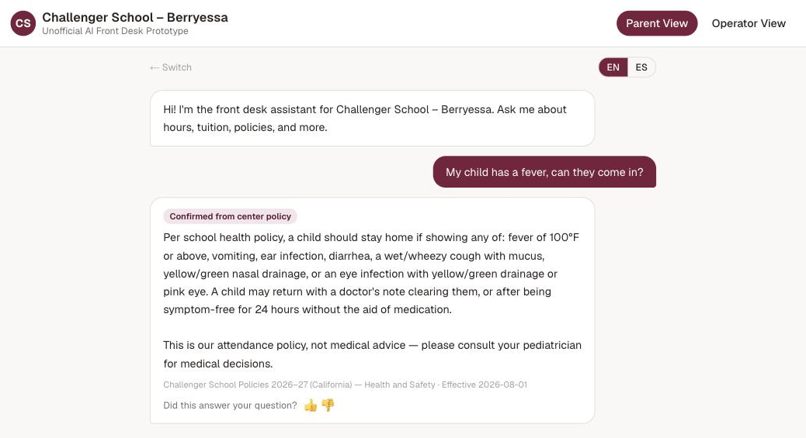

# AI Front Desk (Challenger School Berryessa, unofficial prototype)

> **This project now lives in [applied-ai-agents](https://github.com/roy-vinay/applied-ai-agents/tree/main/agents/school-front-desk)**, alongside my other agents. This repo stays up for its live demo and history.

A parent-facing assistant that answers general school-policy questions with citations, plus an
operator console where staff see what's being asked, publish new answers, and pick up anything the
assistant shouldn't handle.

**Live demo:** https://berryessa-ai-front-desk-unofficial.vercel.app ·
**Full write-up:** [EXPLAINER.md](EXPLAINER.md)



> Unofficial prototype built on the school's published policies. Not affiliated with or endorsed by
> Challenger School.

## What it does

- **Grounded answers with citations** on hours, tuition, uniforms, pickup, illness, and similar topics
- **Clarifies or escalates** instead of guessing; never touches student records or makes policy exceptions
- **Bilingual** (English and Spanish)
- **Operator console:** question log, attention queue, insight clusters, and a knowledge-base editor
- **Policy ingestion** from Google Drive
- **Fallback engine** that keeps answering deterministically if the model is unavailable

## How it's built

Next.js on Vercel, Claude with forced structured output (one response tool, so every answer carries
its grounding and escalation fields), and an operator-managed knowledge base.

## Evals

`evals/` holds scenario cases scored by an LLM judge. The eval runner calls the same system prompt and
tool schema as production, so a failure reflects real behavior.

```bash
npm install
npm run dev      # http://localhost:3000, operator view at /operator
npm run evals    # needs ANTHROPIC_API_KEY in .env.local
```
